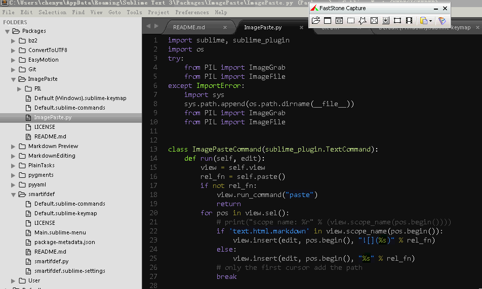

ImagePaste
==========

Paste image from clipboard, save the image to a file and insert the relative path on the current cursor.

# Installation

use package control

# Usage

Take a screenshot, then just ctrl+v to paste it. It will save a png file to current directory and insert the file path in the current cursor. 

1. When copy to markdown buffer, it will display the image path for markdown, eg: \!\[\](pic_path)
2. When copy to other buffer, it will display only the image path pic_path at the cursor. 
 
